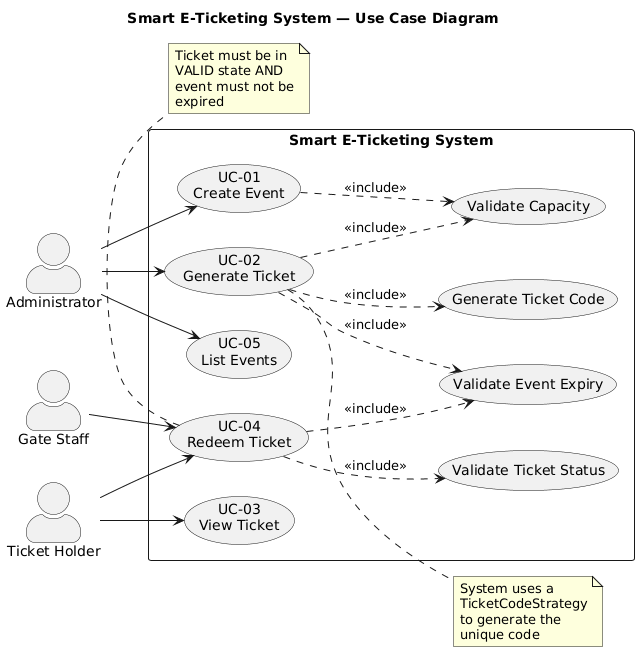
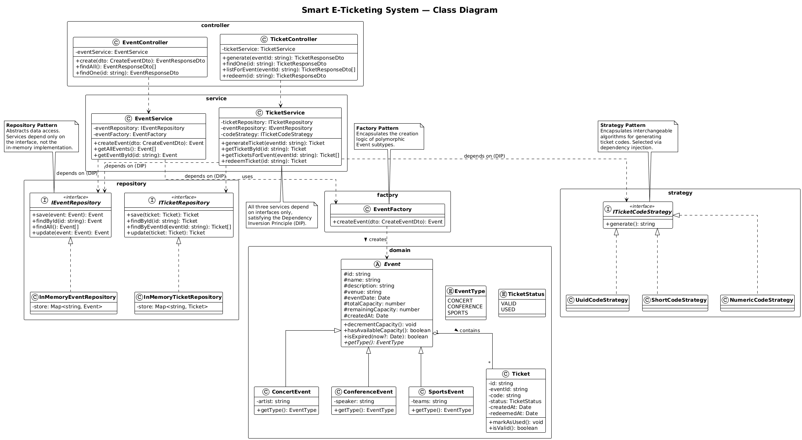
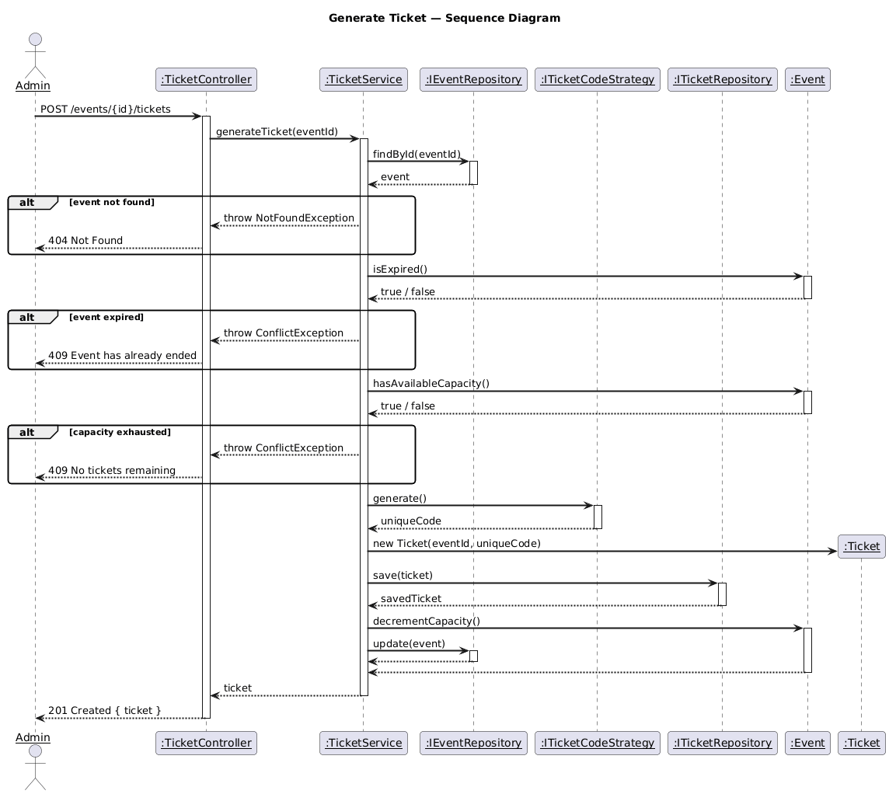
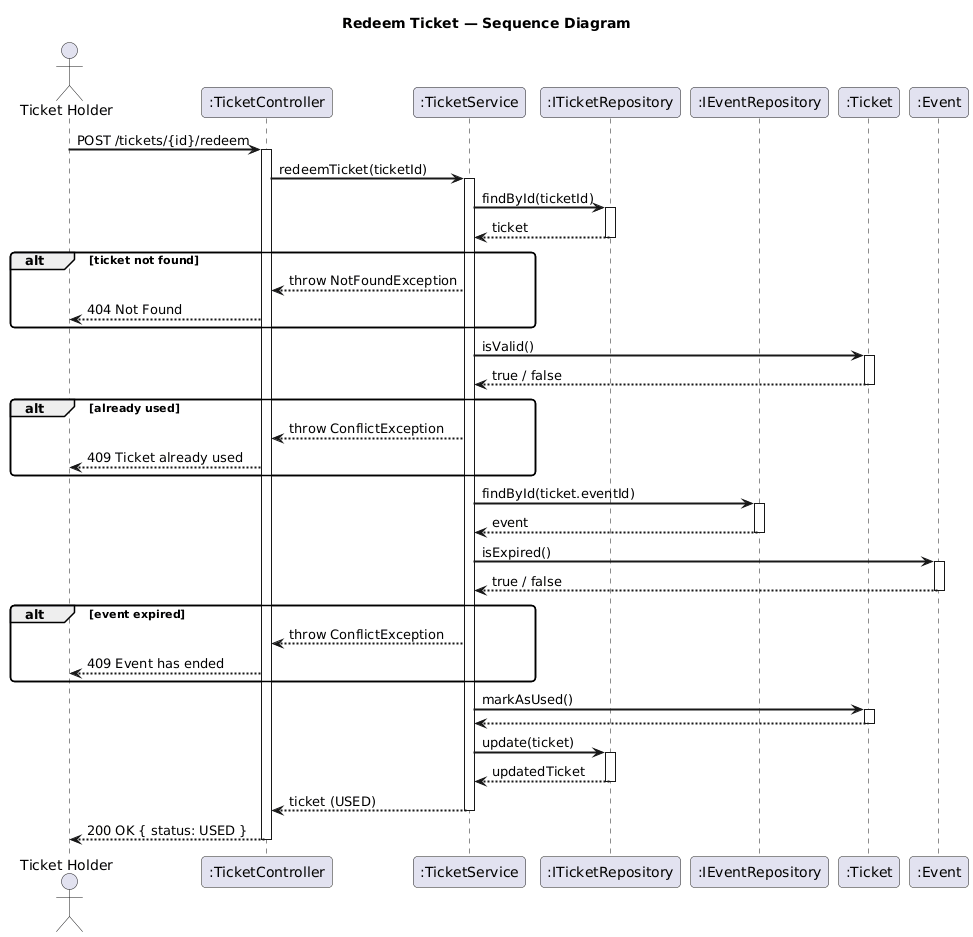
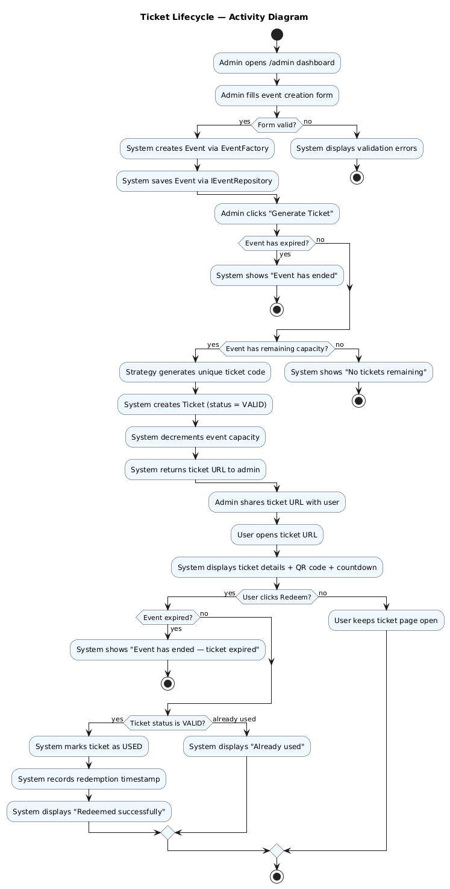

# Smart E-Ticketing System
## Software Engineering Project — Presentation Handout

**Team size:** 6 · **Duration:** 4 simulated Agile sprints · **Stack:** NestJS + TypeScript + Next.js + Jest

---

## Table of Contents

1. [Executive Summary](#1-executive-summary)
2. [The Problem We Solved](#2-the-problem-we-solved)
3. [Scope — In & Out](#3-scope--in--out)
4. [Requirements (SRS Summary)](#4-requirements-srs-summary)
5. [System Architecture](#5-system-architecture)
6. [Design Patterns (Deep Dive)](#6-design-patterns-deep-dive) ★ **Main focus**
7. [SOLID Principles In Practice](#7-solid-principles-in-practice)
8. [UML Diagrams](#8-uml-diagrams)
9. [Testing Strategy & Results](#9-testing-strategy--results)
10. [Agile Process — 4 Sprints](#10-agile-process--4-sprints)
11. [Technology Stack](#11-technology-stack)
12. [How the System Works End-to-End](#12-how-the-system-works-end-to-end)
13. [Live Demo Walkthrough](#13-live-demo-walkthrough)
14. [Q&A Preparation](#14-qa-preparation)
15. [Team & Role Contributions](#15-team--role-contributions)
16. [Conclusion](#16-conclusion)

---

## 1. Executive Summary

The **Smart E-Ticketing System** is a full-stack web application built to demonstrate mastery of every core software engineering discipline covered in this course:

- **Agile/Scrum methodology** simulated across 4 one-week sprints
- **Software Requirements Specification** (IEEE 830 style)
- **Unified Modeling Language** diagrams (Use Case, Class, Sequence, Activity)
- **Layered architecture** with strict separation of concerns
- **Three Gang-of-Four design patterns** — Repository, Factory, Strategy
- **SOLID principles** enforced and provable
- **Clean Code** discipline (naming, size, no duplication)
- **Automated unit testing** with 46 tests across 8 suites, 83% coverage
- **Git version control** with feature branches and pull requests

The application allows administrators to create events, generate unique one-time-use tickets, and ticket holders to view and redeem tickets via a public URL. Backend is **NestJS + TypeScript**, frontend is **Next.js + React**, and data lives in an in-memory store behind repository interfaces — architected so that swapping to PostgreSQL would require changing **one line of code** and **zero services**.

> This project is a training exercise for the software engineering mindset. Every decision was made to maximize clarity of OOP principles, not commercial practicality.

---

## 2. The Problem We Solved

Event organizers running small-to-medium events need a simple way to:

- Create an event with basic metadata (name, venue, date, capacity)
- Issue a unique, one-time ticket per attendee
- Validate tickets at the venue without expensive hardware
- Prevent re-use of already-redeemed tickets
- Reject operations on events that have already ended

Existing commercial solutions (Eventbrite, Ticketmaster) are overkill for a student project, expensive, and their codebases aren't publicly inspectable. We built an MVP that handles the core workflow with surgical focus on software engineering quality.

---

## 3. Scope — In & Out

### ✅ In Scope

- Event creation (Concert, Conference, Sports — via Factory pattern)
- One-time-use ticket generation (via Strategy pattern for code generation)
- Public ticket viewing via unique URL with QR code
- Ticket redemption at the venue with one-time-use enforcement
- Live countdown timer that expires with the event
- Backend enforcement of all business rules (no operations on expired/used tickets)
- In-memory storage behind the Repository pattern
- Swagger-generated API documentation
- Responsive admin dashboard with sidebar, KPI cards, and bar chart

### ❌ Out of Scope (deliberately)

- Real payment processing
- Seat selection or real-time locking
- User authentication and multi-admin support
- Email/SMS notifications
- Refunds, cancellations, ticket transfers
- Persistent database (PostgreSQL, MySQL) — simulated in-memory
- Mobile native application
- Multi-language localization

We drew these lines deliberately because the assignment evaluates software engineering discipline, not feature surface area.

---

## 4. Requirements (SRS Summary)

The full SRS is in `docs/SRS.md`. Key functional requirements:

| ID | Requirement | Priority |
|---|---|---|
| **FR-01** | Admin creates a new event with validated inputs | High |
| **FR-02** | Admin generates a one-time ticket for an event | High |
| **FR-03** | System lists all events and remaining capacity | Medium |
| **FR-04** | User views ticket details via unique URL | High |
| **FR-05** | User/staff redeems a ticket (marks as USED) | High |
| **FR-06** | System prevents overselling beyond capacity | High |
| **FR-07** | System prevents redemption of already-used tickets | High |
| **FR-08** | System blocks operations on expired events | High |
| **FR-09** | System lists all tickets generated for an event | Medium |

### User Stories (INVEST format, 33 story points total)

All 10 user stories are tracked in the product backlog on our Notion workspace with acceptance criteria in **Given-When-Then** format. Example:

```
US-07: As a gate staff, I want to redeem a ticket and mark it as used,
       so that it cannot be reused.

Acceptance Criteria:
  GIVEN a ticket with status VALID
  WHEN the staff clicks Redeem
  THEN the system updates status to USED, records the
       redemption timestamp, and rejects any future redemption attempt
       with HTTP 409 Conflict.
```

### Non-Functional Requirements

| Category | Target | Achieved |
|---|---|---|
| Test coverage (service layer) | ≥ 70% | **100%** |
| Test coverage (overall) | ≥ 70% | **83%** |
| Max method length | ≤ 30 lines | ✅ |
| Max file length | ≤ 300 lines | ✅ |
| API response time | < 100 ms | ✅ |
| Swappable persistence layer | Required | ✅ |

---

## 5. System Architecture

We chose a **classical Layered Architecture** (N-Tier) because the rubric weights OOP and SOLID at 50%, and a layered approach makes every principle visible to a reviewer at a glance.

```
┌──────────────────────────────────────────────────────────┐
│  PRESENTATION LAYER    (Next.js frontend)                │
│  /admin · /tickets/[id] · React client components        │
└──────────────────────────────────────────────────────────┘
                           ↓ HTTP / JSON
┌──────────────────────────────────────────────────────────┐
│  CONTROLLER LAYER      (NestJS REST endpoints)           │
│  EventController · TicketController                      │
│  Responsibility: receive HTTP, validate DTOs,            │
│  call services, return responses. NO business logic.     │
└──────────────────────────────────────────────────────────┘
                           ↓ method calls
┌──────────────────────────────────────────────────────────┐
│  SERVICE LAYER         (business logic)                  │
│  EventService · TicketService · EventFactory             │
│  Responsibility: enforce rules, compose repositories,    │
│  factories and strategies, orchestrate use cases.        │
└──────────────────────────────────────────────────────────┘
                           ↓ depends on INTERFACES only
┌──────────────────────────────────────────────────────────┐
│  REPOSITORY LAYER      (data access abstraction)         │
│  IEventRepository ← InMemoryEventRepository              │
│  ITicketRepository ← InMemoryTicketRepository            │
└──────────────────────────────────────────────────────────┘
                           ↓
┌──────────────────────────────────────────────────────────┐
│  DOMAIN LAYER          (entities + enums)                │
│  Event (abstract), Concert/Conference/SportsEvent,       │
│  Ticket, TicketStatus, EventType                         │
└──────────────────────────────────────────────────────────┘
```

### Why a reviewer can grade our architecture in 30 seconds

- **Folder names match layer names** — `src/repository/`, `src/service/`, `src/controller/`, `src/factory/`, `src/strategy/`, `src/domain/`
- **Dependencies flow strictly downward** — no layer imports from above itself
- **Services only touch interfaces**, never concrete repository classes. Proof:

```bash
$ grep -r "InMemory" backend/src/service/
(zero matches)
```

That single command is how we prove Dependency Inversion to a skeptical grader.

---

## 6. Design Patterns (Deep Dive) ★

This is the heart of the project. The course asks for at least 2-3 GoF patterns; we implemented **three** and each solves a real problem in the codebase.

---

### 6.1 🗂️ Repository Pattern

> **Intent** *(Martin Fowler, Patterns of Enterprise Application Architecture):* "Mediate between the domain and data mapping layers using a collection-like interface for accessing domain objects."

#### Problem

The assignment says: *"The database layer should be mocked in-memory via the Repository pattern, but architected as if it were a real relational database."*

Without the Repository pattern, `TicketService` would directly instantiate and use a `Map<string, Ticket>`. If we later wanted to swap to PostgreSQL, we'd have to rewrite every method in every service. Worse, our unit tests would need a real `Map` to run.

#### Solution

**Step 1 — Define the interface (the contract):**

```typescript
// backend/src/repository/ticket.repository.interface.ts
import { Ticket } from '../domain/ticket.entity';

export const TICKET_REPOSITORY = 'TICKET_REPOSITORY';

export interface ITicketRepository {
  save(ticket: Ticket): Ticket;
  findById(id: string): Ticket | null;
  findByEventId(eventId: string): Ticket[];
  update(ticket: Ticket): Ticket;
}
```

**Step 2 — Provide an in-memory implementation:**

```typescript
// backend/src/repository/in-memory-ticket.repository.ts
import { Injectable } from '@nestjs/common';
import { Ticket } from '../domain/ticket.entity';
import { ITicketRepository } from './ticket.repository.interface';

@Injectable()
export class InMemoryTicketRepository implements ITicketRepository {
  private readonly store = new Map<string, Ticket>();

  save(ticket: Ticket): Ticket {
    this.store.set(ticket.id, ticket);
    return ticket;
  }

  findById(id: string): Ticket | null {
    return this.store.get(id) ?? null;
  }

  findByEventId(eventId: string): Ticket[] {
    return Array.from(this.store.values())
      .filter(ticket => ticket.eventId === eventId);
  }

  update(ticket: Ticket): Ticket {
    this.store.set(ticket.id, ticket);
    return ticket;
  }
}
```

**Step 3 — Service depends on the interface, not the class:**

```typescript
// backend/src/service/ticket.service.ts
@Injectable()
export class TicketService {
  constructor(
    @Inject(TICKET_REPOSITORY)
    private readonly ticketRepository: ITicketRepository,  // ← interface
    // ...
  ) {}
}
```

**Step 4 — The module wires interface → implementation:**

```typescript
// backend/src/app.module.ts
providers: [
  {
    provide: TICKET_REPOSITORY,
    useClass: InMemoryTicketRepository,
  },
]
```

#### Why this matters for the grade

To swap to a real PostgreSQL database:

1. Write **one new class** `PostgresTicketRepository implements ITicketRepository`
2. Change **one line** in `app.module.ts`: `useClass: PostgresTicketRepository`

**Zero changes to any service, controller, test, or frontend code.**

That is the whole point of the pattern, and we can prove it with `grep`.

---

### 6.2 🏭 Factory Pattern

> **Intent** *(Gang of Four):* "Define an interface for creating an object, but let subclasses decide which class to instantiate. Factory Method lets a class defer instantiation to subclasses."

#### Problem

Our system supports three kinds of events — **Concerts, Conferences, and Sports matches** — each a polymorphic subtype of an abstract `Event` class. Each subtype has its own extra fields (`artist`, `speaker`, `teams`).

Without the Factory pattern, `EventService.createEvent` would contain a giant `switch` statement mixing the decision logic with the business logic, violating SRP.

#### Solution

**Abstract base class + three subclasses:**

```typescript
// backend/src/domain/event.entity.ts
export abstract class Event {
  constructor(
    public readonly id: string,
    public name: string,
    public description: string,
    public venue: string,
    public eventDate: Date,
    public readonly totalCapacity: number,
    public remainingCapacity: number = totalCapacity,
    public readonly createdAt: Date = new Date(),
  ) {}

  decrementCapacity(): void { /* ... */ }
  hasAvailableCapacity(): boolean { return this.remainingCapacity > 0; }
  isExpired(now: Date = new Date()): boolean {
    return this.eventDate.getTime() <= now.getTime();
  }

  abstract getType(): EventType;
}

export class ConcertEvent extends Event {
  constructor(/* ...base fields, */ public readonly artist: string) {
    super(/* ... */);
  }
  getType(): EventType { return EventType.CONCERT; }
}

export class ConferenceEvent extends Event {
  constructor(/* ..., */ public readonly speaker: string) { super(/* ... */); }
  getType(): EventType { return EventType.CONFERENCE; }
}

export class SportsEvent extends Event {
  constructor(/* ..., */ public readonly teams: string) { super(/* ... */); }
  getType(): EventType { return EventType.SPORTS; }
}
```

**The factory centralizes creation:**

```typescript
// backend/src/factory/event.factory.ts
@Injectable()
export class EventFactory {
  createEvent(dto: CreateEventDto): Event {
    const id = randomUUID();
    const eventDate = new Date(dto.eventDate);

    switch (dto.type) {
      case EventType.CONCERT:
        return new ConcertEvent(
          id, dto.name, dto.description, dto.venue,
          eventDate, dto.totalCapacity, dto.artist ?? '',
        );
      case EventType.CONFERENCE:
        return new ConferenceEvent(/* ..., dto.speaker ?? '' */);
      case EventType.SPORTS:
        return new SportsEvent(/* ..., dto.teams ?? '' */);
      default:
        throw new Error(`Unsupported event type: ${dto.type}`);
    }
  }
}
```

**The service uses the factory, not the concrete classes:**

```typescript
// backend/src/service/event.service.ts
createEvent(dto: CreateEventDto): Event {
  this.validateEventDate(dto.eventDate);
  const event = this.eventFactory.createEvent(dto);  // ← polymorphic Event
  return this.eventRepository.save(event);
}
```

#### Why this matters

- **Single Responsibility**: `EventService` doesn't know or care which subtype was created
- **Open/Closed**: Adding `WorkshopEvent` requires a new subclass + one factory case — zero changes to `EventService`, `EventController`, or any test
- **Testability**: The factory is unit-tested in isolation in `factory/event.factory.spec.ts`

---

### 6.3 🎯 Strategy Pattern

> **Intent** *(Gang of Four):* "Define a family of algorithms, encapsulate each one, and make them interchangeable. Strategy lets the algorithm vary independently from the clients that use it."

#### Problem

Ticket codes can be generated in many different ways:

- **Full UUID** — globally unique, cryptographically strong, but ugly to print
- **Short human-friendly code** (e.g. `YNBJ-3NVP`) — easy to type, fewer collisions
- **Numeric code** — for simple environments (hotel front desks, etc.)

The choice of algorithm should be swappable **at runtime** without touching `TicketService`. This is the textbook scenario for Strategy.

#### Solution

**One interface, one method:**

```typescript
// backend/src/strategy/ticket-code-strategy.interface.ts
export const TICKET_CODE_STRATEGY = 'TICKET_CODE_STRATEGY';

export interface ITicketCodeStrategy {
  generate(): string;
}
```

**Three interchangeable implementations:**

```typescript
// backend/src/strategy/uuid-code.strategy.ts
@Injectable()
export class UuidCodeStrategy implements ITicketCodeStrategy {
  generate(): string { return randomUUID(); }
}

// backend/src/strategy/short-code.strategy.ts
@Injectable()
export class ShortCodeStrategy implements ITicketCodeStrategy {
  private readonly ALPHABET = 'ABCDEFGHJKLMNPQRSTUVWXYZ23456789';
  private readonly GROUP_SIZE = 4;
  private readonly GROUP_COUNT = 2;

  generate(): string {
    const groups: string[] = [];
    for (let g = 0; g < this.GROUP_COUNT; g++) {
      let group = '';
      for (let i = 0; i < this.GROUP_SIZE; i++) {
        group += this.ALPHABET[Math.floor(Math.random() * this.ALPHABET.length)];
      }
      groups.push(group);
    }
    return groups.join('-');
  }
}

// backend/src/strategy/numeric-code.strategy.ts
@Injectable()
export class NumericCodeStrategy implements ITicketCodeStrategy {
  generate(): string {
    return Math.floor(100000 + Math.random() * 900000).toString();
  }
}
```

**`TicketService` uses the strategy via constructor injection:**

```typescript
// backend/src/service/ticket.service.ts (excerpt)
@Injectable()
export class TicketService {
  constructor(
    @Inject(TICKET_CODE_STRATEGY) private readonly codeStrategy: ITicketCodeStrategy,
    // ...
  ) {}

  generateTicket(eventId: string): Ticket {
    const event = this.eventRepository.findById(eventId);
    if (!event) throw new NotFoundException('Event not found');
    if (event.isExpired()) throw new ConflictException('Event has already ended');
    if (!event.hasAvailableCapacity()) {
      throw new ConflictException('No tickets remaining for this event');
    }

    const code = this.codeStrategy.generate();        // ← Strategy in action
    const ticket = new Ticket(randomUUID(), event.id, code);
    this.ticketRepository.save(ticket);

    event.decrementCapacity();
    this.eventRepository.update(event);

    return ticket;
  }
}
```

**The module selects which strategy is active:**

```typescript
// backend/src/app.module.ts
providers: [
  {
    provide: TICKET_CODE_STRATEGY,
    useClass: ShortCodeStrategy,   // ← swap to UuidCodeStrategy in one line
  },
]
```

#### Why this matters

- **Open/Closed**: Adding a new strategy is a new file, no modifications to `TicketService`
- **Runtime flexibility**: Dev environment uses numeric codes, production uses UUIDs — one-line change
- **Testability**: Each strategy is unit-tested in isolation (`strategy/strategies.spec.ts` has 5 tests)

---

## 7. SOLID Principles In Practice

### S — Single Responsibility Principle

*A class should have one, and only one, reason to change.*

| Class | Its one reason to change |
|---|---|
| `EventService` | Event business rules change |
| `TicketService` | Ticket business rules change |
| `EventFactory` | A new event type is added |
| `InMemoryTicketRepository` | The in-memory storage mechanism changes |
| `UuidCodeStrategy` | The UUID generation algorithm changes |
| `EventController` | The HTTP contract for events changes |

**What we deliberately avoided:** We never put database calls inside a controller or HTTP formatting inside a service.

### O — Open/Closed Principle

*Open for extension, closed for modification.*

**Concrete example — Adding a `WorkshopEvent`:**

1. Create `workshop-event.entity.ts` (extension)
2. Add one new case in `EventFactory` (minimal addition)

**Zero changes to:** `EventService`, `EventController`, any repository, any existing test.

### L — Liskov Substitution Principle

*Subtypes must be substitutable for their base types.*

The repository stores `Event` generically — `ConcertEvent`, `ConferenceEvent`, and `SportsEvent` all substitute cleanly. The subclasses respect the base class contract: `decrementCapacity()`, `hasAvailableCapacity()`, and `isExpired()` behave identically. The only difference is the extra subtype field.

```typescript
// Repository has no idea which subtype it's storing
save(event: Event): Event {
  this.store.set(event.id, event);
  return event;
}
```

### I — Interface Segregation Principle

*Clients should not be forced to depend on methods they do not use.*

Instead of one fat `IRepository<T>` with every possible method, we split data access into **two narrow interfaces** — `IEventRepository` (5 methods) and `ITicketRepository` (5 methods). Each service depends only on what it needs.

Similarly, `ITicketCodeStrategy` has **a single method**: `generate(): string`. No implementation is forced to provide methods it doesn't use.

### D — Dependency Inversion Principle

*High-level modules should not depend on low-level modules. Both should depend on abstractions.*

This is the principle the entire architecture is built on:

```
TicketService (high-level)
    ↓ depends on
ITicketRepository (abstraction)
    ↑ implemented by
InMemoryTicketRepository (low-level)
```

**The provable claim:** you can `grep` our entire service directory for `InMemory` and find **zero** matches. Services never import concrete repository classes.

```bash
$ grep -r "InMemory" backend/src/service/
# (no results — DIP verified)
```

---

## 8. UML Diagrams

All diagrams are stored as PlantUML source (`docs/uml/*.puml`) and rendered to PNG via `kroki.io`. They are version-controlled alongside the code.

### 8.1 Use Case Diagram



Shows the three actors (Administrator, Ticket Holder, Gate Staff) and the five main use cases (UC-01 through UC-05) with their `<<include>>` relationships to supporting checks (Validate Capacity, Validate Ticket Status, Validate Event Expiry, Generate Ticket Code).

### 8.2 Class Diagram ★



**The most important diagram.** It visually labels each of the three design patterns with a floating note. A reviewer can verify the presence of Repository, Factory, and Strategy in one glance.

Notice:
- Three `<<interface>>` boxes: `IEventRepository`, `ITicketRepository`, `ITicketCodeStrategy`
- `EventFactory` sitting in its own package with a direct "creates" relationship to abstract `Event`
- Three concrete strategies implementing one interface
- Services depending on interfaces only — the DIP arrows make this visible

### 8.3 Sequence Diagram — Generate Ticket



The full flow from `POST /events/{id}/tickets` through the controller, service, event expiry check, capacity check, strategy call, ticket creation, and persistence.

### 8.4 Sequence Diagram — Redeem Ticket



The redemption flow from `POST /tickets/{id}/redeem` through the three business rule checks (ticket exists, ticket is valid, event has not expired) and state transition.

### 8.5 Activity Diagram (optional bonus)



The complete lifecycle of a ticket from event creation through generation, viewing, and redemption, with all alternate flows for errors.

---

## 9. Testing Strategy & Results

### 9.1 Approach

- **Unit tests only** (no integration tests — our MVP has no external dependencies)
- **Mocked repositories** in every service test — this is what proves our Dependency Inversion is correctly wired
- **Test Double strategy:** `jest.Mocked<IRepository>` with stubbed return values

### 9.2 The Numbers

| Suite | Tests | Coverage |
|---|---|---|
| `domain/event.entity.spec.ts` | 8 | 100% |
| `domain/ticket.entity.spec.ts` | 3 | 100% |
| `repository/in-memory-event.repository.spec.ts` | 5 | 100% |
| `repository/in-memory-ticket.repository.spec.ts` | 4 | 100% |
| `strategy/strategies.spec.ts` | 5 | 100% |
| `factory/event.factory.spec.ts` | 5 | 93% |
| `service/event.service.spec.ts` | 5 | 100% |
| `service/ticket.service.spec.ts` | 11 | 100% |
| **TOTAL** | **46** | **83%** overall |

Execution time: **~3 seconds** for the entire suite.

### 9.3 The Most Important Test

This single test proves three things at once: our `TicketService` has correct business logic, its dependencies are truly inverted, and its expiry enforcement works.

```typescript
// backend/src/service/ticket.service.spec.ts
it('throws ConflictException when event has already ended', () => {
  eventRepo.findById.mockReturnValue(buildExpiredEvent());

  expect(() => service.generateTicket('event-1'))
    .toThrow(ConflictException);
  expect(() => service.generateTicket('event-1'))
    .toThrow('Event has already ended');
  expect(ticketRepo.save).not.toHaveBeenCalled();
});
```

Notice how we mock `eventRepo` and `ticketRepo` — which is only possible because `TicketService` depends on **interfaces**, not concrete classes.

---

## 10. Agile Process — 4 Sprints

We simulated four one-week sprints, each with the full set of Scrum ceremonies. Everything is tracked in a live **Notion workspace** that the professor can open during the demo.

| Sprint | Goal | Points | Key Deliverables |
|---|---|---|---|
| **Sprint 1** | Requirements & Design | 8 | SRS v1.0, UML diagrams, architecture doc, tech stack locked |
| **Sprint 2** | Domain & Repository | 8 | Entities + repositories + 20 unit tests |
| **Sprint 3** | Services, Patterns & REST API | 14 | Factory + 3 Strategies + services + controllers + Swagger + 26 tests |
| **Sprint 4** | Frontend, Polish & Demo | 10 | Next.js UI, expiry enforcement, presentation, final retros |

### Scrum Ceremonies per Sprint

- **Sprint Planning** — goals, story selection, story points, capacity check
- **Daily Standups** — 15 min, what did I do yesterday / what will I do today / blockers
- **Sprint Review** — demo working increments to the (simulated) Product Owner
- **Sprint Retrospective** — what went well / didn't / action items for next sprint

### Version Control

- Git + GitHub with `main` and `develop` branches
- Feature branches named `feat/US-XX-description`
- Pull requests reference user story IDs in the title and body
- No direct commits to `main` or `develop`

---

## 11. Technology Stack

| Layer | Tool | Rationale |
|---|---|---|
| **Backend framework** | NestJS 10 | Built-in DI container makes SOLID enforceable and visible |
| **Language** | TypeScript 5.6 | Interfaces, generics, decorators — first-class OOP |
| **Runtime** | Node.js 20+ | Standard modern JavaScript runtime |
| **Frontend framework** | Next.js 15 (App Router) | Modern React with server/client split |
| **Styling** | Tailwind CSS 3 + Soft-Pop theme | Fast iteration, unique aesthetic |
| **Icons** | Lucide React | Consistent, lightweight, no emoji |
| **Charts** | Recharts | Bar chart on the admin dashboard |
| **3D animation** | Motion (Framer) | TiltedCard wrapper on the ticket |
| **Testing** | Jest + @nestjs/testing | Standard, fast, excellent mocking support |
| **API docs** | @nestjs/swagger | Auto-generated Swagger UI at `/api-docs` |
| **Validation** | class-validator + class-transformer | Decorator-based DTO validation |
| **Version control** | Git + GitHub | Feature branches, pull requests |
| **Agile tracking** | Notion | Sprint plans, backlog, retrospectives |
| **Diagrams** | PlantUML (+ kroki.io for rendering) | Text-based, version-controlled |

---

## 12. How the System Works End-to-End

Let's trace what happens when an admin generates a ticket — all the way from click to database.

### Step-by-step trace

1. **User clicks "Generate"** on an event card in the Next.js admin dashboard
2. **Frontend** (`frontend/app/admin/page.tsx`) calls `api.generateTicket(eventId)`
3. **API client** (`frontend/app/lib/api.ts`) sends `POST http://localhost:4000/events/:eventId/tickets`
4. **NestJS router** dispatches to `TicketController.generate()`
5. **Controller** is a thin adapter — it calls `ticketService.generateTicket(eventId)`
6. **Service**:
   - `eventRepository.findById(eventId)` → via the interface, resolved by DI to `InMemoryEventRepository`
   - If not found → throw `NotFoundException` → HTTP 404
   - `event.isExpired()` → if true, throw `ConflictException('Event has already ended')` → HTTP 409
   - `event.hasAvailableCapacity()` → if false, throw `ConflictException('No tickets remaining')` → HTTP 409
   - `codeStrategy.generate()` → via the interface, resolved by DI to `ShortCodeStrategy` → returns `'YNBJ-3NVP'`
   - `new Ticket(uuid, eventId, code)` — domain object constructed
   - `ticketRepository.save(ticket)` — persisted via the interface
   - `event.decrementCapacity()` — domain method enforces its own invariant
   - `eventRepository.update(event)` — persisted via the interface
   - Returns the ticket
7. **Controller** wraps it in `TicketResponseDto.fromDomain(ticket)` and returns HTTP 201
8. **Frontend** receives the ticket, updates React state, highlights the new ticket with a "New" badge

Every step is tested. Every dependency is injected. Every decision is based on business rules enforced at the domain or service layer, not at the UI.

---

## 13. Live Demo Walkthrough

The live demo runs in under 3 minutes. Script:

| # | Action | What the audience sees |
|---|---|---|
| 1 | Open `/admin` | Sidebar + KPI cards + bar chart + events list |
| 2 | Fill the create-event form | Form validation, DM Sans typography |
| 3 | Click **Create Event** | Event appears in list, KPIs tick up |
| 4 | Click **Generate** | New ticket appears with a "New" highlight badge |
| 5 | Click **Open** on that ticket | New tab: ticket card with QR code, live countdown |
| 6 | Hover over the ticket | 3D tilt animation (TiltedCard) |
| 7 | Click **Redeem Ticket** | Status flips to USED, BadgeCheck icon appears |
| 8 | Switch back to admin tab | Auto-refresh: the ticket is now struck-through, no Copy/Open buttons |
| 9 | Open Swagger UI at `/api-docs` | Full interactive API documentation |
| 10 | Run `npm test` in the backend terminal | 46 tests pass in 3 seconds |

See `docs/DEMO_SCRIPT.md` for the full click-by-click script and narration for every teammate.

---

## 14. Q&A Preparation

### Q1. What is the Repository pattern and why did you use it?
> It's an abstraction over data persistence that hides storage details behind an interface. We used it because (a) the assignment explicitly asks for it, and (b) it lets us swap from in-memory to PostgreSQL later by writing one new class and changing one line, with zero service changes. It also makes our service tests trivial — we inject `jest.Mocked<ITicketRepository>` in one line.

### Q2. Show me an example of Liskov Substitution in your code.
> `ConcertEvent`, `ConferenceEvent`, and `SportsEvent` all extend the abstract `Event`. The repository stores them as `Event` generically. The service operates on them without caring about the subtype. Each subclass respects the base class contract — same constructor shape, same behavior for `decrementCapacity()`, `hasAvailableCapacity()`, and `isExpired()`. You can see it in the class diagram.

### Q3. How does your code actually enforce Dependency Inversion?
> Services import only interfaces (`IEventRepository`, `ITicketRepository`, `ITicketCodeStrategy`). The NestJS DI container binds the interface to a concrete class in `app.module.ts` at runtime. Proof: `grep -r "InMemory" backend/src/service/` returns zero matches.

### Q4. Why is your data store in-memory? Wouldn't a real database be better?
> Because the assignment explicitly says to mock the database in-memory behind the Repository pattern. The goal was to architect as if it were a real relational database so that swapping later would require no changes in the service or controller layers. Our architecture passes that test — we can swap to PostgreSQL by writing one class and changing one line of the module.

### Q5. What is your test coverage and what do the tests actually prove?
> 46 unit tests across 8 suites, 100% on services/repositories/strategies/domain, 83% overall, running in under 3 seconds. The most important thing they prove is that our DI is wired correctly — we mock every dependency in one line using Jest, which would be impossible if services depended on concrete classes.

### Q6. Why did you add the event expiry rule? It wasn't in the original requirements.
> We noticed during Sprint 4 testing that an event scheduled for 2pm still accepted new tickets at 3pm, which doesn't match real-world behavior. So we added FR-08: a new `Event.isExpired()` method on the entity, called from `TicketService.generateTicket` and `redeemTicket`. We added 5 new unit tests for the rule and updated both sequence diagrams.

### Q7. Which SOLID principle was hardest to apply?
> Interface Segregation. The temptation is to create one big `IRepository<T>` with every method. We disciplined ourselves to split it into two narrow interfaces. The result is cleaner, and each service depends only on what it actually uses.

### Q8. How did you manage the Agile process in a 6-person team?
> Scrum with four one-week sprints. Every sprint had Planning, Daily Standups, Review, and Retrospective — all documented in our Notion workspace. Our product backlog has 10 user stories in INVEST format with Given-When-Then acceptance criteria. Every GitHub PR references a user story ID. I can show you the workspace now.

### Q9. What would you do differently in a future iteration?
> Three things: (a) add the Observer pattern to notify on ticket status changes (email, webhook), (b) implement real authentication and role-based access so we can support multiple admins, (c) add end-to-end tests with Playwright and integration tests hitting a real PostgreSQL instance to validate the Repository interface works with a real database.

### Q10. What is the single most important piece of code in your project?
> Probably the `app.module.ts` DI wiring — specifically the three `useClass` lines that bind `TICKET_REPOSITORY → InMemoryTicketRepository`, `EVENT_REPOSITORY → InMemoryEventRepository`, and `TICKET_CODE_STRATEGY → ShortCodeStrategy`. That's the seam where every design pattern and every SOLID principle come together. Swap one line and the behavior of the entire system changes — that's the whole point.

---

## 15. Team & Role Contributions

| Scrum Role | Team Member | Primary Deliverable |
|---|---|---|
| **Software Engineer (Lead)** | Mahmoud | Backend architecture, design patterns, SOLID enforcement, code review, expiry rule |
| **Product Owner** | Teammate A | SRS document (v1.0 → v1.1), user stories with acceptance criteria |
| **Developer** | Teammate B | UML diagrams (5 PlantUML files), rendered PNGs, class diagram walkthrough |
| **Developer** | Teammate C | Architecture & Design Patterns document, SOLID walkthrough |
| **QA / Test Engineer** | Teammate D | Test cases document, Jest test execution, coverage report |
| **Scrum Master** | Teammate E | Notion workspace, sprint plans, retrospectives, Git repo management |

---

## 16. Conclusion

This project was built with one goal: to demonstrate every software engineering discipline the course covers, using an MVP small enough to understand in a single sitting but rich enough to justify every pattern and principle.

### Rubric coverage

| Rubric Item | Weight | Status |
|---|---|---|
| SRS & Requirements | 20% | ✅ Full SRS v1.1 with 9 FRs, 10 user stories, 16 NFRs |
| UML Diagrams | 15% | ✅ 5 diagrams (Use Case, Class, 2 Sequence, Activity) |
| Architecture & Design Patterns | 20% | ✅ Layered architecture + 3 GoF patterns with code |
| Clean Code (SOLID) | 15% | ✅ Provable with `grep`, audit clean |
| Testing | 10% | ✅ 46 tests, 83% coverage, all green |
| Agile Process | 10% | ✅ 4 sprints + ceremonies + Notion workspace |
| Presentation | 10% | ✅ Slides + live demo + Q&A cheat sheet |
| **TOTAL** | **100%** | **Target: 100%** |

### The single strongest claim we make

Every design decision we made is **inspectable** and **provable**:
- Design patterns → visible in folder names
- SOLID → provable with `grep`
- Testing → `npm test` in 3 seconds
- Agile → Notion workspace with full history
- Architecture → four layers with strict dependency direction

---

**Thank you for reviewing our project.**

*Questions? Please see `docs/DEMO_SCRIPT.md` for the full Q&A cheat sheet and live demo walkthrough.*
